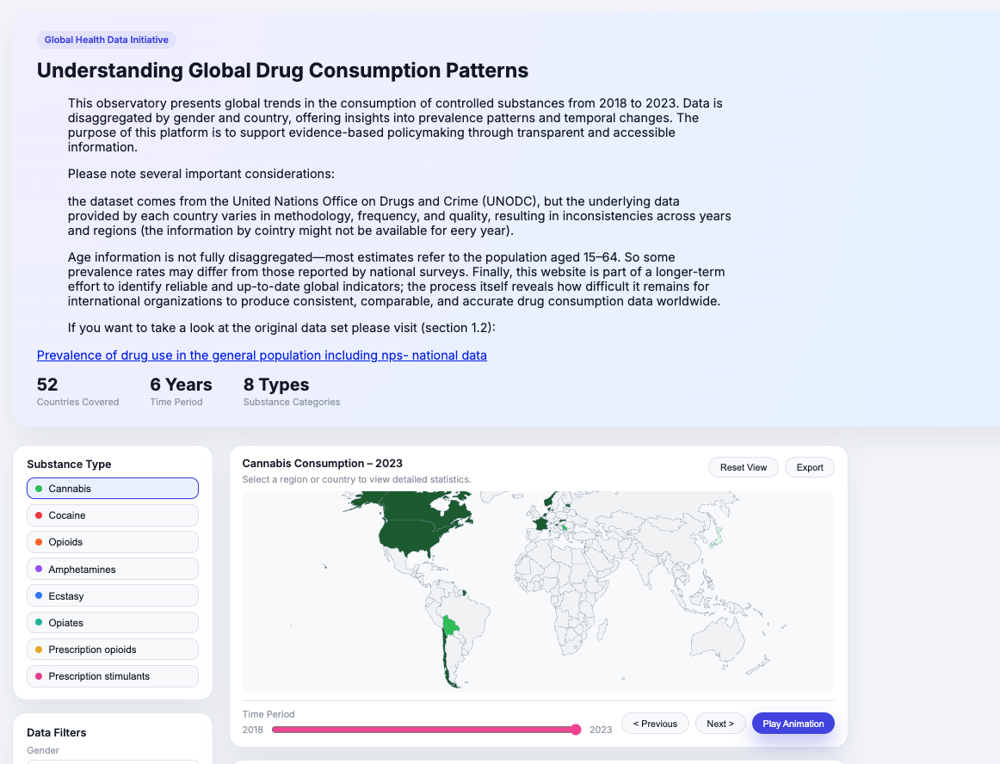

# Understanding Global Drug Consumption Patterns

Maria Jose Reyes

## Description

This observatory presents global trends in the consumption of controlled substances from 2018 to 2023. Data is disaggregated by gender and country, offering insights into prevalence patterns and temporal changes. The purpose of this platform is to support evidence-based policymaking through transparent and accessible information.
Please note several important considerations:
the dataset comes from the United Nations Office on Drugs and Crime (UNODC), but the underlying data provided by each country varies in methodology, frequency, and quality, resulting in inconsistencies across years and regions (the information by cointry might not be available for eery year).
Age information is not fully disaggregated—most estimates refer to the population aged 15–64. So some prevalence rates may differ from those reported by national surveys. Finally, this website is part of a longer-term effort to identify reliable and up-to-date global indicators; the process itself reveals how difficult it remains for international organizations to produce consistent, comparable, and accurate drug consumption data worldwide.

## Data Sources

1. Prevalence of drug use in the general population including nps- national data:
https://www.unodc.org/unodc/en/data-and-analysis/world-drug-report-2025-annex.html
