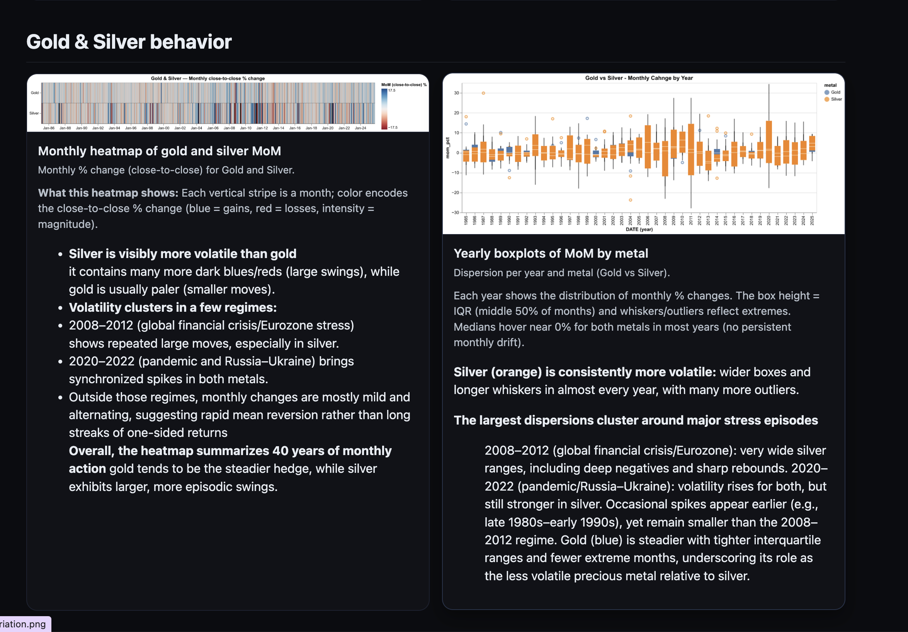

# Geopolitical Events Impact on Stock Prices

Maria Jose Reyes Ramirez

## Description

The porpuse of this project is to analyze the impact various geopolitical events
that pose risks to international stability on the stock market, and to what extend
these events influence the price of commodities such as silver and gold
which are widely considered safe -haven assets during periods of market uncertainty. 

## Data Sources

1. Shreyansh, D. (2025).*Gold-Silver Price VS Geopolitical Risk (1985–2025)*. Kaggle. https://www.kaggle.com/datasets/shreyanshdangi/gold-silver-price-vs-geopolitical-risk-19852025?resource=download

2. Caldara, D. & Iacoviello, M. (2022). *Measuring Geopolitical Risk*. American Economic Review, April, 112(4), pp.1194-1225.
https://www.matteoiacoviello.com/gpr.htm

Reminder: Your final PDF/HTML also **must** contain citations for your data.