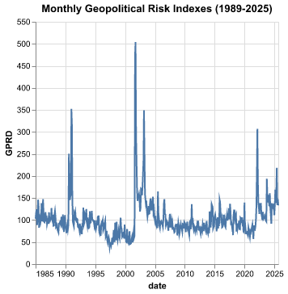
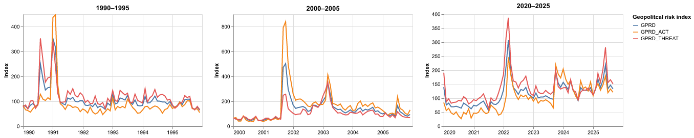

Maria Jose Reyes

## What is your current goal? Has it changed since the proposal?

My initial goal was to examine how different geopolitical events influence the prices of precious metals and oil, aiming to provide insights into how safe-haven assets fluctuate during periods of international uncertainty.

However, as I delved deeper into the data, I became increasingly curious about the role that newspapers play in shaping stock market speculation versus actual stock price movements. Since the Geopolitical Risk Index is built from articles published in ten major newspapers—many of which are highly influential in financial markets—I would like to explore how the narratives and frequency of these publications affect market behavior. To pursue this, I am currently seeking additional data on the volume of articles published by these outlets and ways to correlate their content with stock market dynamics.

## Are there data challenges you are facing? Are you currently depending on mock data?

The main data challenge I expect to face is gathering detailed information on the publications released by each of these newspapers—specifically, the articles related to geopolitical events and analyses. Collecting and classifying this data will be complex, as it involves tracking how often these outlets report on major geopolitical developments and evaluating the tone, content, and potential influence of such reporting on stock market behavior.

## Monthly Geopolitical Risk Index (single)
The following chart shows the monthly behavior of the Geopolitical Risk Index (GPRD) from 1985 to 2025. This index measures "adverse geopolitical events based n tally of news paaper articles covering geopolitical tensions, and examine its evolution and economic effects since 1900". 

The index considers 10 news papers: 

- Chicago Tribune
- The Daily Telegraph
- Financial Times
- The Globe and Mail 
- The Guardian
- The Los Angeles Times
- The New York Times
- USA Today
- The Wall Street Journal 
- The Washington Post

From the chart it can be observed that there are 3 major pikes in the data. For 3 different time periods, each one of 5 years, some possible events that might have caused the pikes are:

**1.  1990-1995:**
    *Gulf War* Iraq's invasion of Kuwait and the subsequent U.S. led coalition war to liberate Kuwait. 

**2. 2000-2005:**
    *9/11* Terrorist attacks in the U.S.
    *Invasion of Afghanistan* The start of the "War on Terror" campaing added sustained geopolitical tension. 
    *Iraq War* The U.S.-led invasion of Iraq.

**3. 2020-2025**
    *2022* Russian invasion of Ukraine, one of the highest peaks after 9/11, reflecting direct military conflict between a nuclear power and Western-backed Ukraine.
    *Middle East Tensions* Rising hostilities involving Iran, Israel, and non-state actors increased geopolitical risk.
    *COVID-19 Pandemic* This is not precisely a geopolitial event, but it triggered global instability and economic shocks that indirectly increased perceived risk and international tensions.

# Monthly Geopolitical Risk Index, GPRD_ACT, GPRD_THREAT

This data set counts with 2 subsets of the Geopolitical risk index, which are: 

**1.  GPRD_ACT** 
This index captures realized geopolitical acts between 1985 and 2019. Although originally measured on a daily basis, for the purposes of this project the data has been aggregated into monthly averages. 

**2. GPDR_THREAT** This subindex captures perceived geopolitical threats between 1985-2019

The idea of this graph is to compare the behavior of the main index (GPRD), with its corresponding subindexes, and see which one has more incidence on the main index. If the therat of a geopoitical act or the actual occurrence of a geopolitical act that brings uncertainty to the market. 

## Periods Peaks Closer look
Considering the analysis of the previous two charts, the purpose of this visualization is to focus on the three time periods with the highest peaks in the data in order to understand what occurred during those years and how different newspapers included in the index reported these events. As mentioned before, these peaks correspond to three major geopolitical crises: the Gulf War (1990–1991), the 9/11 terrorist attacks (2001), and the Russian invasion of Ukraine (2022).

From this closer look, we can observe that the factor influencing the global index the most is not necessarily an ongoing war, but rather the threat of one—or, more broadly, the anticipation of geopolitical conflict. This raises an important question: Which scenario makes financial markets more vulnerable—an active war or the threat of geopolitical instability that prompts investors to relocate assets and adjust investment strategies?

## What form do you envision your final narrative taking? (e.g. An article incorporating the images? A poster? An infographic?)
